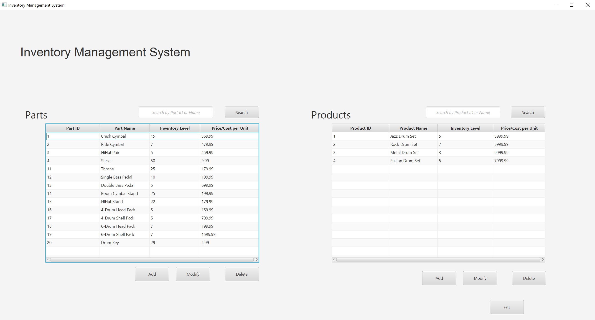
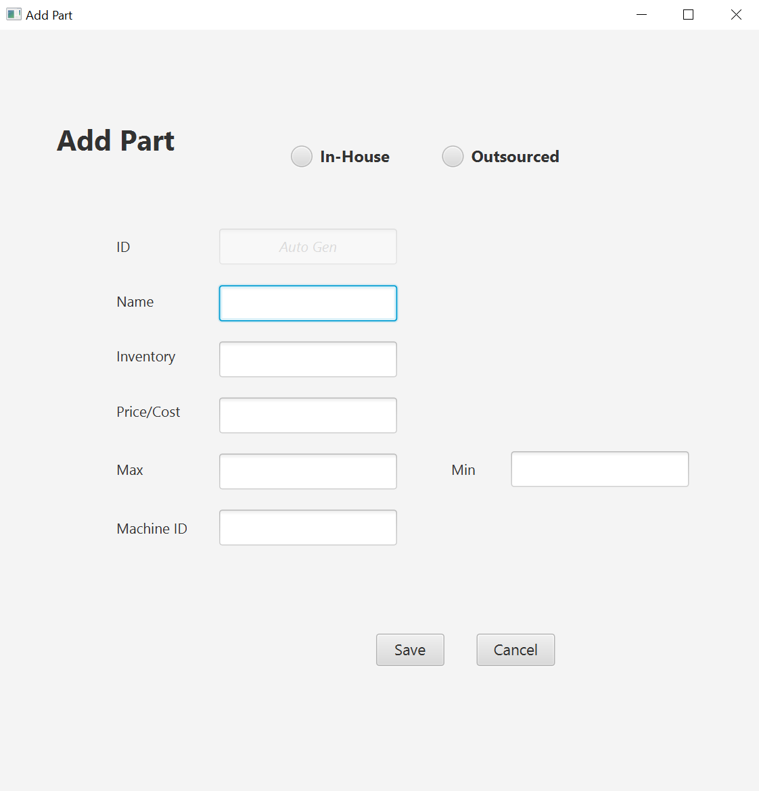
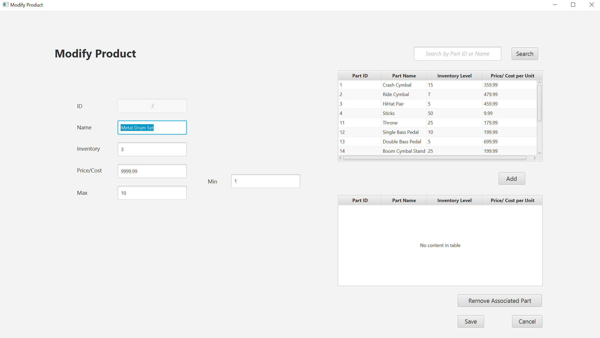

# IMSPro - An Inventory Management Solution

## A simple inventory management app built with Java and JavaFX.

IMSPro is an inventory management application built to allow users to accurately track inventory of individual parts, as well as products that are made up of those parts. 
This app is written with vanilla Java, and leverages JavaFX to provide the user with a simple and clean graphical user interface.

## Features

Users can add, modify, or delete parts and products.
Also, individual parts can be associated with products.

